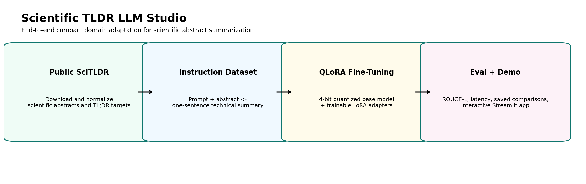
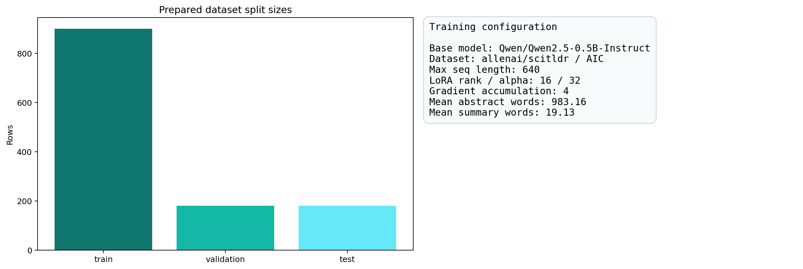
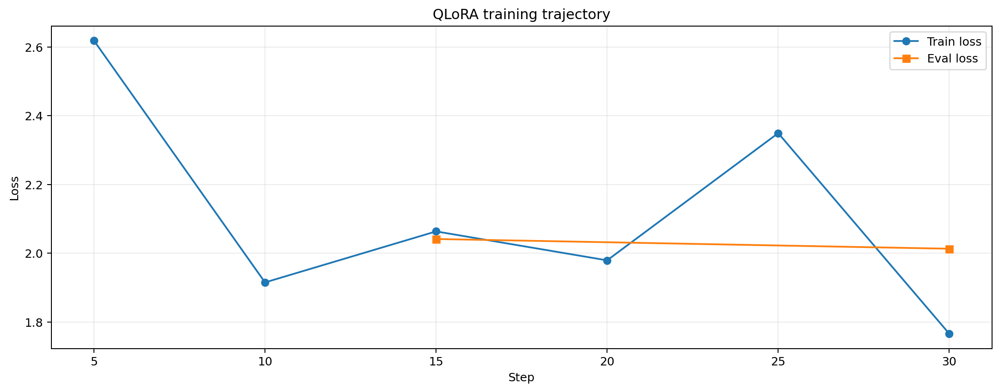
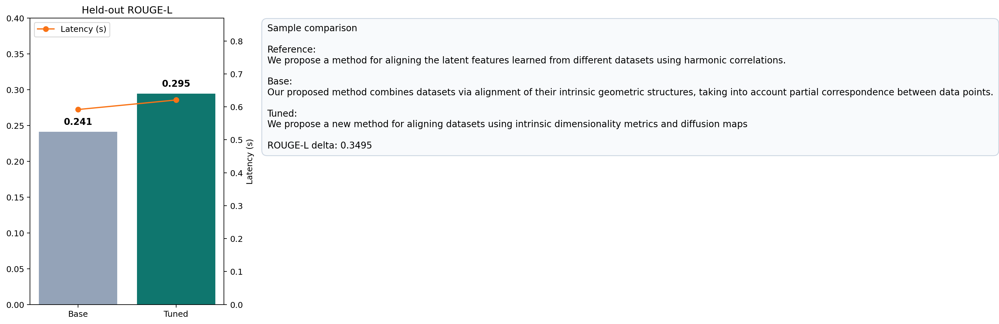

# Scientific TLDR LLM Studio

Fine-tune and optimize a small domain LLM for scientific abstract summarization using `QLoRA`, `PEFT`, `Transformers`, and `Streamlit`.

This project adapts `Qwen/Qwen2.5-0.5B-Instruct` on the public `allenai/scitldr` dataset so the model can generate short, technical `TL;DR` summaries for scientific abstracts. It includes dataset preparation, 4-bit fine-tuning, baseline-vs-adapter evaluation, qualitative comparisons, and a local demo app for interviews.

Repository target: `https://github.com/msa-1988/scientific-tldr-llm-studio`

## Interface Preview

### Pipeline overview



### Dataset and training configuration



### Training curve



### Base vs fine-tuned comparison



## What This Project Shows

- public-dataset curation for instruction tuning
- 4-bit `QLoRA` fine-tuning on a consumer GPU
- `PEFT` adapter training with low VRAM overhead
- baseline vs fine-tuned evaluation on held-out samples
- latency and quality comparison for the optimized runtime
- a local demo surface for qualitative comparison and interview walkthroughs

## Validation Snapshot

Current validated MVP run:

- Base model: `Qwen/Qwen2.5-0.5B-Instruct`
- Fine-tuning method: `LoRA` on a `4-bit NF4` quantized base model
- Train / validation / test rows: `900 / 180 / 180`
- Trainable parameter ratio: `2.7162%`
- Training run: `30` optimizer steps on a consumer GPU

Held-out sample evaluation on `40` test examples:

| Model | ROUGE-L | Mean latency (s) | Mean generated tokens |
| --- | ---: | ---: | ---: |
| Base | `0.2413` | `0.5919` | `38.25` |
| Fine-tuned adapter | `0.2947` | `0.6208` | `23.32` |

Key deltas:

- `+0.0534` ROUGE-L over the base model
- `-14.93` generated tokens on average, producing tighter summaries
- a small latency increase of `+0.0289s` per generation

## Current MVP Setup

- Base model: `Qwen/Qwen2.5-0.5B-Instruct`
- Task: scientific abstract to one-sentence `TL;DR`
- Dataset: `allenai/scitldr`
- Fine-tuning method: `LoRA` on a 4-bit quantized base model
- Demo surface: `Streamlit`

## Workflow

1. Download and normalize `SciTLDR`
2. Turn each abstract into an instruction-tuning sample
3. Fine-tune a small instruct model with `QLoRA`
4. Evaluate `base` vs `fine-tuned` generations on held-out examples
5. Save metrics, training logs, and qualitative comparisons
6. Explore the results in the local comparison app

## Local Run

### 1. Environment

```bash
python3 -m venv .venv
source .venv/bin/activate
pip install -r requirements.txt
```

### 2. Prepare the dataset

```bash
python scripts/prepare_dataset.py
```

### 3. Fine-tune the adapter

```bash
python scripts/train_model.py --max-steps 30
```

### 4. Evaluate base vs adapter

```bash
python scripts/evaluate_model.py --sample-count 40
```

### 5. Generate README visuals

```bash
python scripts/generate_readme_visuals.py
```

### 6. Launch the demo app

```bash
./scripts/run_local.sh
```

Open `http://localhost:8503`

## Validation

Fast sanity check:

```bash
python scripts/smoke_test.py
```

## Expected Artifacts

The training and evaluation pipeline writes:

- `artifacts/dataset_profile.json`
- `artifacts/training_summary.json`
- `artifacts/evaluation_metrics.json`
- `artifacts/qualitative_examples.json`
- `artifacts/base_eval_predictions.json`
- `artifacts/tuned_eval_predictions.json`
- `artifacts/adapter/`

## Project Layout

```text
.
├── app/
│   ├── streamlit_app.py
│   └── src/
├── artifacts/
├── data/
│   ├── processed/
│   └── README.md
├── screenshots/
├── scripts/
├── .streamlit/
├── README.md
└── requirements.txt
```

## Notes

- This project is tuned for a compact public demo and a realistic local GPU workflow, not for leaderboard chasing.
- The fine-tuned adapter improves domain alignment; it does not replace larger instruction-tuned models on broad open-domain tasks.
- The public repo contains only code, visuals, and generated metrics. The local learning notes stay outside Git history.
